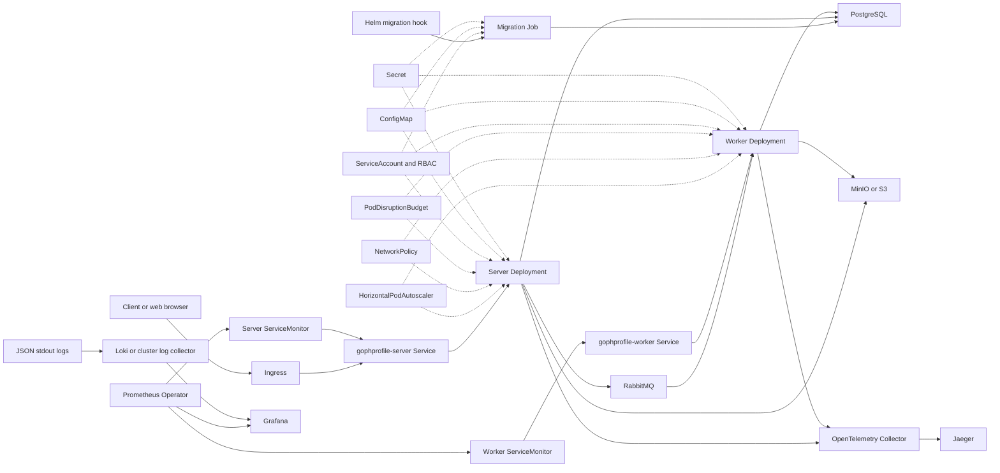
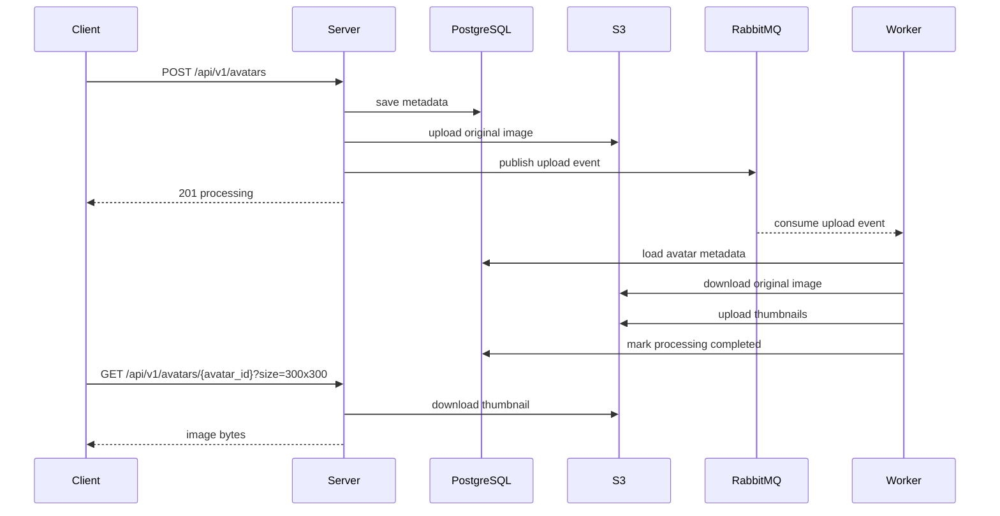

# GophProfile Architecture

## Kubernetes Deployment

```mermaid
flowchart LR
    client["Client or web browser"] --> ingress["Ingress"]
    ingress --> serverSvc["gophprofile-server Service"]
    serverSvc --> serverPods["Server Deployment"]
    helmHook["Helm migration hook"] --> migrateJob["Migration Job"]
    migrateJob --> postgres["PostgreSQL"]
    serverPods --> postgres["PostgreSQL"]
    serverPods --> minio["MinIO or S3"]
    serverPods --> rabbitmq["RabbitMQ"]
    rabbitmq --> workerPods["Worker Deployment"]
    workerPods --> postgres
    workerPods --> minio
    serverPods --> otel["OpenTelemetry Collector"]
    workerPods --> otel
    otel --> jaeger["Jaeger"]
    prometheus["Prometheus Operator"] --> smServer["Server ServiceMonitor"]
    prometheus --> smWorker["Worker ServiceMonitor"]
    smServer --> serverSvc
    smWorker --> workerSvc["gophprofile-worker Service"]
    workerSvc --> workerPods
    prometheus --> grafana["Grafana"]
    logs["JSON stdout logs"] --> loki["Loki or cluster log collector"]
    loki --> grafana
    hpa["HorizontalPodAutoscaler"] -.-> serverPods
    hpa -.-> workerPods
    networkPolicy["NetworkPolicy"] -.-> serverPods
    networkPolicy -.-> workerPods
    pdb["PodDisruptionBudget"] -.-> serverPods
    pdb -.-> workerPods
    serviceAccount["ServiceAccount and RBAC"] -.-> serverPods
    serviceAccount -.-> workerPods
    serviceAccount -.-> migrateJob
    configMap["ConfigMap"] -.-> serverPods
    configMap -.-> workerPods
    configMap -.-> migrateJob
    secret["Secret"] -.-> serverPods
    secret -.-> workerPods
    secret -.-> migrateJob
```

## Request Flow

```mermaid
sequenceDiagram
    participant Client
    participant Server
    participant PostgreSQL
    participant S3
    participant RabbitMQ
    participant Worker

    Client->>Server: POST /api/v1/avatars
    Server->>PostgreSQL: save metadata
    Server->>S3: upload original image
    Server->>RabbitMQ: publish upload event
    Server-->>Client: 201 processing
    RabbitMQ-->>Worker: consume upload event
    Worker->>PostgreSQL: load avatar metadata
    Worker->>S3: download original image
    Worker->>S3: upload thumbnails
    Worker->>PostgreSQL: mark processing completed
    Client->>Server: GET /api/v1/avatars/{avatar_id}?size=300x300
    Server->>S3: download thumbnail
    Server-->>Client: image bytes
```
